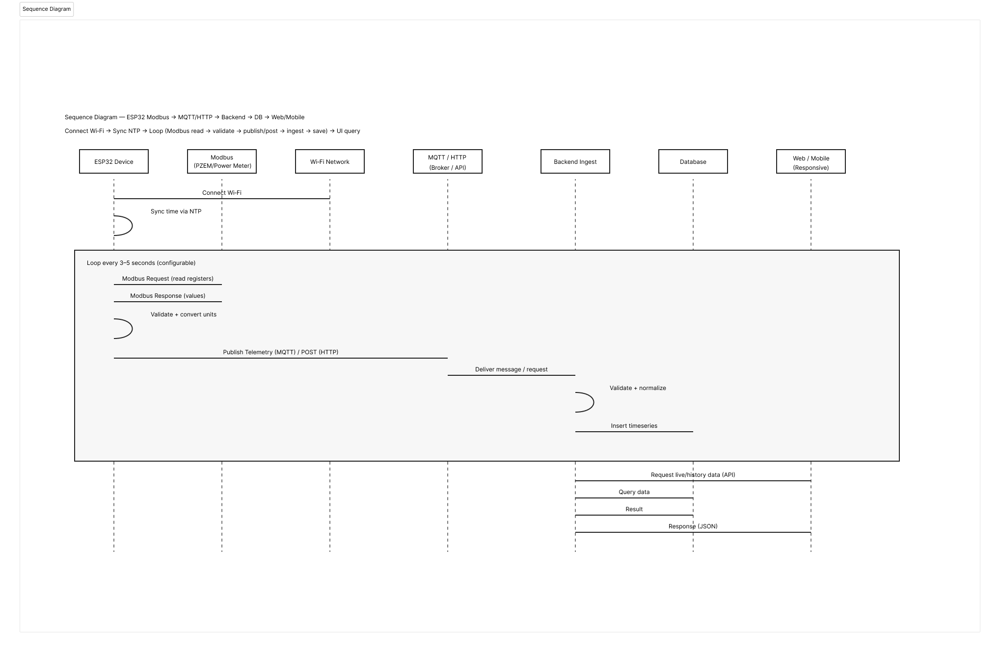

# Sequence Diagrams

Dokumen ini berisi kumpulan sequence diagram untuk menjelaskan urutan komunikasi antar komponen (ESP32, Modbus, Transport, Backend, DB, UI).

## 1. Telemetry Loop (Modbus → Publish/POST → Ingest → Save)

Diagram ini menjelaskan alur utama sistem saat device berjalan normal:
- ESP32 connect Wi-Fi
- Sync waktu via NTP
- Loop tiap 3–5 detik: baca Modbus → validasi → publish/post → backend ingest → simpan DB
- UI query untuk live/history

### Notes
- Interval saat ini: 3–5 detik (configurable, bisa lebih cepat dimasa mendatang)
- Timestamp: NTP di ESP32
- Transport: MQTT atau HTTP (sesuai ADR)

## 2. (TODO) Device Onboarding / Pairing Flow
Akan menjelaskan proses:
- device register (manual/auto)
- assign ke location/tenant
- verifikasi deviceId & firmware version

## 3. (TODO) Alarm & Notification Flow
Akan menjelaskan proses:
- data masuk → cek threshold → buat event → kirim notifikasi (Telegram)
- dedup alarm & cooldown

## 4. (TODO) Report Generation Flow
Akan menjelaskan proses:
- query telemetry → agregasi → pagination → tampil di UI
